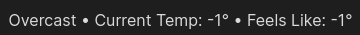
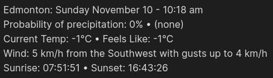
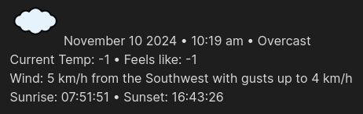
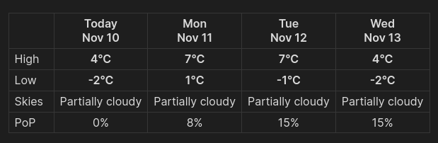
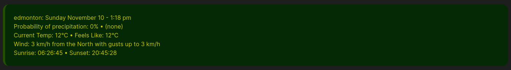
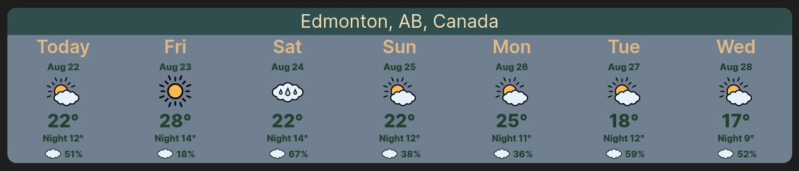

# Weather Templates

<!-- ## Table of Contents -->

## TIPS
#### Use for More Than Just Weather
If you have a piece of text that you regularly enter into your notes you can define it as one of the 8 templates, and insert it into your code whenever needed. Optionally you could assign a hotkey to the command to insert that template. This is even more useful if you find you are only using 1 or 2 of the 8 templates to begin with.

#### Edit Your Templates in Obsidian
To ensure your template inserts properly formatted text, edit it within Obsidian, then copy and paste it into the settings. The text areas used in Obsidians settings can be difficult to edit. A good example is the default template 5 which inserts the weather in a table. Trying to edit a table in the settings text area is very difficult at best and is very likly to not render properly.

## The Default Templates Screenshots

> Note: All screenshots were taken using Obsidians default theme
> They may appear different while using another theme

### 1) Short one liner
A quick one line example



### 2) More detailed
This adds a few more details



### 3) Historical DIV (I personally use this in my daily notes)
I use this in my daily notes


### 4) Current DIV (I personally use this in my daily notes)
I use this in my daily notes



### 5) Today with next 3 days in a table
Displays the weather for the next 3 days in a table



### 6) Weather in a block quote
Displays the weather in a custom block quote



This can be customized using CSS. To do so create a css file in your vaults `.obsidian/snippets` folder Eg. vcBlockquote.css and add the following text...

```css
.quote-vc {
  --blockquote-background-color: rgb(5, 40, 5);  /* Background color */
  --blockquote-color: rgb(202, 202, 0);  /* Text color */
  --blockquote-border-color: rgb(35, 80, 0);
  --blockquote-border-thickness: 0.4em;
  border-radius: 16px;
}
```
Note that the `.obsidian` folder is a hidden folder so you may need to enable `show hidden files` in your file manager. The `snippets` folder may need to be created if it does not already exist in your vault.

Then enable the CSS snippet in Obsidians settings under appearance/CSS snippets (at the bottom).

The example CSS text above is the default settings for the custom Block Quotes. Feel free to customize it to your preferences. `.quote-vc` is the class name for the Block Quote.

For more information, see [Obsidian CSS variables](https://docs.obsidian.md/Reference/CSS+variables/CSS+variables) and [CSS variables for Blockquotes](https://docs.obsidian.md/Reference/CSS+variables/Editor/Blockquote)

### 7) Weather in a callout
Displays the weather in a callout. There are 3 variants available by changing the `type identifier`.

Type one (normal weather), defined with type identifier `> [!weather-vc]-`

.png)

Type two (hot weather), defined with type identifier `> [!weather-hot-vc]-`

.png)

Type three (cold weather), defined with type identifier `> [!weather-cold-vc]-`

.png)

These are can be customized using CSS. To do so create a css file in your vaults `.obsidian/snippets` folder Eg. vcCallouts.css and add the following text...

```css
.callout[data-callout="weather-vc"] {
  --callout-color: var(--color-green-rgb);
  --callout-icon: lucide-thermometer;
  --callout-radius: var(--radius-xl);
  --icon-size: var(--icon-xl);
  color: var(--color-yellow);
}

.callout[data-callout="weather-cold-vc"] {
  --callout-color: var(--color-blue-rgb);
  --callout-icon: lucide-thermometer-snowflake;
  --callout-radius: var(--radius-xl);
  --icon-size: var(--icon-xl);
  color: var(--color-orange);
}

.callout[data-callout="weather-hot-vc"] {
  --callout-color: var(--color-yellow-rgb);
  --callout-icon: lucide-thermometer-sun;
  --callout-radius: var(--radius-xl);
  --icon-size: var(--icon-xl);
  color: var(--color-orange);
}
```
Note that the `.obsidian` folder is a hidden folder so you may need to enable `show hidden files` in your file manager. The `snippets` folder may need to be created if it does not already exist in your vault.

Then enable the CSS snippet in Obsidians settings under appearance/CSS snippets (at the bottom).

The example CSS text above is the default settings for the callouts. Feel free to customize it to your preferences. `weather-vc` is the `type identifier` for the normal weather callout. `weather-hot-vc` is the `type identifier` for the hot weather callout. `weather-cold-vc` is the `type identifier` for the hot weather callout.

For more information, see [Obsidian CSS variables](https://docs.obsidian.md/Reference/CSS+variables/CSS+variables) and [CSS variables for Callouts](https://docs.obsidian.md/Reference/CSS+variables/Editor/Callout)


### 8) Weather for the next week
Displays the weather for the next 7 days. This is accomplished with HTML div's and CSS



This can be customized using CSS. To do so create a css file in your vaults `.obsidian/snippets` folder Eg. vc7days.css and add the following text...

```css
.container-vc {
  display: flex;
  flex-wrap: wrap;
  background: rgb(112,128,144);  /* This sets the background color */
  border-radius: 16px;
}

.child-title {
  flex: 1 0 95%;
  font-size: xx-large;
  height: 48px;
  border-top-left-radius: 16px;
  border-top-right-radius: 16px;
  text-align: center;
  align-content: center;
  justify-content: center;
  color: wheat;
  background-color: darkslategray;  /* This sets the title background color */
}

.child-wide-day {
  flex: 1 0 14%;
  font-size: xx-large;
  font-weight: 600;
  height: 42px;
  text-align: center;
  align-content: center;
  color: burlywood;  /* This sets the color for the day of the week */
}

.child-wide-date {
  flex: 1 0 14%;
  font-size: medium;
  font-weight: bold;
  height: 28px;
  text-align: center;
  align-content: center;
  color: rgb(35, 65, 45);  /* This sets the color for the date */
}

.child-wide-icon {
  flex: 1 0 14%;
  font-size: smaller;
  height: 64px;
  text-align: center;
  align-content: center;
}

.child-wide-temp {
  flex: 1 0 14%;
  font-size: xx-large;
  font-weight: 700;
  height: 36px;
  text-align: center;
  align-content: center;
  color: rgb(35, 65, 45);  /* This sets the color for the days high temperature */
}

.child-wide-night {
  flex: 1 0 14%;
  font-size: medium;
  font-weight: bold;
  height: 24px;
  text-align: center;
  align-content: center;
  color: rgb(35, 65, 45);  /* This sets the color for the days low temperature */
}

.child-narrow-left {
  flex: 1 0 6%;
  padding-top: 5px;
  height: 32px;
  text-align: right;
  padding-right: 2px;
  align-content: center;
}

:nth-child(1 of .child-narrow-left) {
  border-bottom-left-radius: 16px;
}

.child-narrow-right {
  flex: 1 0 6%;
  height: 32px;
  font-weight: bold;
  text-align: left;
  padding-left: 2px;
  align-content: center;
  color: rgb(35, 65, 45);  /* This sets the color for the cloud cover percentage */
}

:nth-child(7 of .child-narrow-right) {
  border-bottom-right-radius: 16px;
}

Note that the .obsidian folder is a hidden folder so you may need to enable show hidden files in your file manager. The snippets folder may need to be created if it does not already exist in your vault.

Then enable the CSS snippet in Obsidians settings under appearance/CSS snippets (at the bottom).


[Return to README.md](../README.md)
