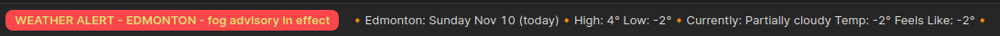
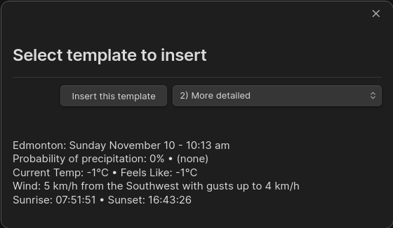

# Visual Crossing Weather

## Table of Contents
- [Introduction](#introduction)
- [Features](#features)
- [Template Macros](#template-macros)
- [The Statusbar Weather Display & Templates](#the-statusbar-weather-display--templates)
- [The Weather Templates](#the-weather-templates)
- [Obsidian & Templater Templates Support](#obsidian--templater-templates-support)
- [Plugin Commands](#plugin-commands)
- [Settings](#settings)
    - [Visual Crossing API authentification Key](#visual-crossing-api-authentification-key)
    - [Primary location](#primary-location)
    - [Additional locations 1 to 4](#additional-locations-1-to-4)
    - [Units of measurement](#units-of-measurement)
    - [Exclude template folder](#exclude-template-folder)
    - [Update frequency](#update-frequency)
    - [Show weather in the statusbar](#show-weather-in-the-statusbar)
    - [Cycle statusbar display](#cycle-statusbar-display)
    - [Primary statusbar template](#primary-statusbar-template)
    - [Secondary statusbar template](#secondary-statusbar-template)
    - [Weather templates](#weather-templates)
- [Dynamic Weather Using DIV's](#dynamic-weather-using-divs)


## Introduction
This is a replacement for my [OpenWeather](https://github.com/willasm/obsidian-open-weather) plugin. Open Weather has discontinued its version 2.5 API on which that plugin is based. They do have a 3.0 API, but that requires a credit card to subscribe to and a lot of people, myself included, are not willing to do that.

Quite a while ago a user requested a feature that was not available in the Open Weather API but mentioned it was available in the Visual Crossing API. After looking closer at the API I saw many advantages in switching to over to it. The only thing that had stopped me is it meant a complete re-wite of the plugin as the differences in the API's was far to great and having to maintain 2 plugins that did the same thing seemed pointless. Now that Open Weather has discontinued API 2.5 I am free to develop this new plugin.

This new plugin uses the [Visual Crossing](https://www.visualcrossing.com/) API.

You can get your [free API key here](https://www.visualcrossing.com/sign-up). It is free and does not require a credit card.

[Table of Contents](#table-of-contents)


## Features
- Get weather data from 5 locations (OpenWeather plugin only had 1)
- Display current weather in the statusbar
  - The statusbar strings are customizable
  - Has 2 statusbar template strings which can be displayed alternating every 30 seconds
  - Default has todays weather info for the first one, tomorrows weather for the second
  - Clicking on the weather data in the statusbar will open a modal with detailed info on todays weather
- Insert current weather into your documents
  - Can be previewed before insertion when using the insert weather template modal
- Eight customizable weather templates available (OpenWeather plugin only had 4)
- [Template support](#obsidian--templater-templates-support) for automatic weather insertion into your new documents
- [DIV support](#dynamic-weather-using-divs) for dynamic weather
- 14 Day forecast data available from the API
- Several thousand (3767 currently) macro text replacements with more to come
  - Once I start adding the hourly data this number will increase substantialy
- Includes all core elements of my OpenWeather plugin, auto replace templates, etc.
- Templates are now named. The first line is used as the name in the menus and is not included in the output of the template
- Many overall improvements to much of the code
- Many new features planned for the future

[Table of Contents](#table-of-contents)


## Template Macros
The text macros are used to represent a weather data object and will be expanded to display that particular weather data item at runtime. All macros are contained within 2 percent signs. For an example, `%temp%` represents the current temperature and will be replaced by eg. `24`. `%humidity%` represents the current humidity and will be replaced with eg. `80%`. For a detailed complete list of available macros in table form see [Macros.md](./Documentation/Macros.md)

[Table of Contents](#table-of-contents)


## The Statusbar Weather Display & Templates

> Note: this feature is not available in the mobile version

### The current Weather
The current weather is displayed in the statusbar. This is optional and can be disabled in the settings if you would like to remove it. The string itself is completely customizable and can be defined to display whatevever information you would like to see. There is also a second statusbar template string available. By default both strings are displayed in the statusbar, alternating every 30 seconds. This behavior can also be disabled in the settings if you wish. Disabling this would result in only the first string being displayed. The default strings display the current weather information for the first one and the second displays weather information for tommorow.

The default first string `🔸%address%: %dow2-today% %month3-today% %date1-today%🔸High: %tempmax-today%° Low: %tempmin-today%°🔸Currently: %conditions% Temperature: %temp%° Feels Like: %feelslike%°🔸` displays...


The default second string `🔸%address%: %dow2-in1day% %month3-in1day% %date1-in1day%🔸High: %tempmax-in1day%° Low: %tempmin-in1day%° 🔸 Clouds: %cloudcover-in1day% Probabilty of precipitation: %precipprob-in1day% (%preciptype-in1day%)🔸` displays...


The statusbar cycling...



### Weather Alerts
If a weather alert is active it will be displayed in the statusbar in red. Only one alert is displayed at a time with your primary location taking the highest precedence, then your additional locations in the order that they are entered in the settings. Mouse over the statusbars weather alert to see a description of the alert. Click the statusbars weather alert text to open in your default browser the web page associated with the alert.

Example of a weather alert...


For more detailed information on the statusbar templates see [Statusbar Templates.md](./Documentation/Statusbar%20Templates.md)

[Table of Contents](#table-of-contents)


## The Weather Templates

> The weather templates are used to insert weather information into your documents
> 
> Note: The first line of these templates is the text string used in the command palette and and insert template modal. This first line is not inserted with the rest of the template. You should use short meaningful descriptions on the first line when defining your own templates.

There are 8 available templates that can be inserted into your documents. These are completely customizable and can be used to display the weather in any format you wish to see. These templates can be inserted either from the command palette or from the insert weather template modal. The insert weather template modal can be displayed either from the command pallete or by selecting the thermometer icon in Obsidians ribbon bar.

Command palette...


Insert weather template modal...



For a much more detailed overview of the weather templates see [Weather Templates.md](./Documentation/Weather%20Templates.md)

[Table of Contents](#table-of-contents)


## Obsidian & Templater Templates Support
Insertion of the weather templates can be automated by using Obsidian or Templater plugin templates. Simply add the following to your templates.

- `%weather1%` - Inserts weather template One
- `%weather2%` - Inserts weather template Two
- `%weather3%` - Inserts weather template Three
- `%weather4%` - Inserts weather template Four
- `%weather5%` - Inserts weather template Five
- `%weather6%` - Inserts weather template Six
- `%weather7%` - Inserts weather template Seven
- `%weather8%` - Inserts weather template Eight

The strings above will autmatically be replaced with the templates data when a new file is created with the template or you insert the template into an existing document. Note that the Templater plugin is not required to expand the weather string templates, that is handled by this plugin itself.

[Table of Contents](#table-of-contents)


## Plugin Commands
#### All these commands are available from the command palette

- `Visual Crossing Weather: Insert 'template title' Template` - Inserts the named weather template into the current document.
  - Each of the 8 templates will appear here, but only when the template is actually defined
  - The title of the template is taken from the first line of the template See [Weather Templates.md](#the-weather-templates) for more info
- `Visual Crossing Weather: Insert template from Picker with Preview` - Displays a modal allowing you see a preveiw of the selected template before insertion
- `Visual Crossing Weather: Replace template strings` - This will replace all occurences of the weather template strings, `%weather1%` to `%weather8%` with the corresponding defined weather templates data. This should normally not be required as the plugin should automatically do this for you. This command is available in case you wish to do the replacements in an excluded folder.

[Table of Contents](#table-of-contents)


## Settings
#### **Visual Crossing API authentification Key**
Enter your Visual Crossing API Key here (Required)

Go here to get your [Visual Crossing](https://www.visualcrossing.com/) API key or use this direct link to the sign up page for your [free API key](https://www.visualcrossing.com/sign-up)

#### **Primary location**
You must add at least your primary location here, the additional locations are optional

#### **Additional locations 1 to 4**
If you wish to get weather information for any additional locations you may define them here (optional)

#### **Units of measurement**
Select from the dropdown United States, Metric, United Kingdom, or Base
Note: Base returns temperatures in degrees Kelvin, not very useful in this application

#### **Exclude template folder**
You must add your templates folder here. Not doing so would result in all defined weather templates being replaced with weather data. There is an optional second exclude folder which could be useful for your scripts folder. This second one is optional.

#### **Update frequency**
Time interval for updating the current weather information that is displayed in the statusbar and [DIV's](#dynamic-weather-using-divs) (5, 10, 15, 20, 30 or 60 minutes). How often the weather data is actually updated is dependent on the weather stations near your location. I Recommend setting this to 10 to 30 minutes. The weather stations near you are not likely to update in a shorter time than that.

#### **Show weather in the statusbar**
Toggles the weather display in the statusbar on or off

#### **Cycle statusbar display**
Toggles cycling the statusbar weather display between the 2 statusbar templates on or off. The templates are alternated every 30 seconds

#### **Primary statusbar template**
This template will always be displayed in the statusbar when enabled

#### **Secondary statusbar template**
This template will only be displayed when statubar cycling is enabled. Each template will be displayed every 30 seconds

#### **Weather templates**
These are the 8 weather templates used to insert weather data into your documents

> Note: The first line is used by the command palette menu to identify the template
>
> This line is not inserted into your document, see the default templates for examples

For a much more detailed overview of the templates see [Weather Templates.md](#the-weather-templates)

[Table of Contents](#table-of-contents)


## Dynamic Weather Using DIV's
You can insert the following DIV's inside your documents to provide dynamic weather which is updated at the frequency set in the [settings _Update Frequency_](#update-frequency) setting. The `weather_historical_3` is the weather information recorded at the time the document is created and the `weather_current_4` is dynamic current weather information. 

```html
<div class="weather_historical_3">%weather3%</div>
<div class="weather_current_4"></div>
```

For example this is what I use in my daily template...


You can use the following class's to insert the corresponding weather templates

- "weather_current_1" Inserts dynamic weather template One
- "weather_current_2" Inserts dynamic weather template Two
- "weather_current_3" Inserts dynamic weather template Three
- "weather_current_4" Inserts dynamic weather template Four
- "weather_current_5" Inserts dynamic weather template Five
- "weather_current_6" Inserts dynamic weather template Six
- "weather_current_7" Inserts dynamic weather template Seven
- "weather_current_8" Inserts dynamic weather template Eight

and...

- "weather_historical_1" Inserts static weather template One
- "weather_historical_2" Inserts static weather template Two
- "weather_historical_3" Inserts static weather template Three
- "weather_historical_4" Inserts static weather template Four
- "weather_historical_5" Inserts static weather template Five
- "weather_historical_6" Inserts static weather template Six
- "weather_historical_7" Inserts static weather template Seven
- "weather_historical_8" Inserts static weather template Eight

> Note: I will be adding an example vault explaing how to accomplish this very soon
>
> It is a very involved process which can not be summarized in this short document

[Table of Contents](#table-of-contents)
